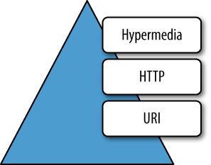

# Hafta 2

## Kodlama Kısmı

### Swagger

Link: **<http://localhost:8082/swagger-ui/index.html>**

### h2-console

Link: **<http://localhost:8082/h2-console>**

JDBC URL: **jdbc:h2:mem:dcbapp**

User Name: **sa**

## Araştırma Kısmı

### 1. Spring dışında dependency injection için kullanabileceğimiz framework’ler / kütüphaneler nelerdir ? (Herhangi bir programlama dili için olabilir.)

JVM tabanlı olan Spring benzeri bir full stack framework olarak [Micronaut](https://micronaut.io/) örnek verilebilir.

NodeJS için örnek vermek gerekirse [NestJS](https://nestjs.com/) ve [LoopBack](https://loopback.io/doc/index.html) backend uygulamaları için tercih edilmektedir. Frontend için ise [Angular](https://angular.io/) örneği verilebilir.

### 2. @SpringBootApplication anotasyonu hangi anotasyonları kapsamaktadır ? Görevlerini kısaca açıklayınız

**@SpringBootApplication** anotasyonu kullanıldığı zaman:

- **@Configuration**
- **@EnableAutoConfiguration**
- **@ComponentScan** anotasyonlarını default attribute'leri ile birlikte kullanmış oluruz.

#### 2.1 **@EnableAutoConfiguration**

Spring Boot'un auto-configuration mekanizmasını etkinleştirmek için kullanılır. Auto-configuration mekanizması, eklenilen jar bağımlılıklarına göre Spring uygulamasını otomatik olarak yapılandırmaya çalışır. Örneğin classpath'te HSQLDB varsa ve herhangi bir database connection bean manuel olarak konfigüre edilmemişse in-memory database Spring Boot tarafından otomatik olarak konfigüre edilir.

#### 2.2 **@ComponentScan**

Uygulamanın bulunduğu package'da @Component'leri bulup Spring'in bu @Component'leri için bean'ları oluşturmasını sağlar.

#### 2.3 **@Configuration**

Context'te ekstra bean'lerin register edilmesine izin verir ya da ek konfigürasyon class'larının import edilmesini sağlar.

### 3. @Primary, @Qualifier anotasyonlarının kullanım amaçlarını açıklayınız

Bazen @Autowired anotasyonunun kullanımı tek başına Spring'in hangi bean'i inject etmesi gerektiğini tek başına açıklamaya yetmez. Varsayılan olarak Spring autowired entry'leri type'a göre çözümler. Bir container'da aynı type'ta birden fazla bean mevcutsa NoUniqueBeanDefinitionException'ı fırlatır. Bu durumda @Primary, @Qualifier anotasyonlarını kullanarak Spring'in hangi bean'ı inject etmesi gerektiğini belirleyebiliriz.

```java
@Component("fooFormatter")
public class FooFormatter implements Formatter {

    public String format() {
        return "foo";
    }
}

@Component("barFormatter")
public class BarFormatter implements Formatter {

    public String format() {
        return "bar";
    }
}

// @Qualifier anotasyonu kullanımı için örnek
public class FooService {

    @Autowired
    @Qualifier("fooFormatter")
    private Formatter formatter;

}
```

```java
@Configuration
public class Config {

    @Bean
    public Employee johnEmployee() {
        return new Employee("John");
    }

    // Primary bean'ının kullanılması için @Primary anotasyonunu kullanıyoruz.
    @Bean
    @Primary
    public Employee tonyEmployee() {
        return new Employee("Tony");
    }
}
```

Hem @Qualifier hem de @Primary anotasyonları mevcutsa, @Qualifier anotasyonunun önceliğe sahip olacağını belirtmekte fayda var. Temel olarak, @Primary bir varsayılanı tanımlarken @Qualifier çok spesifiktir.

### 4. Convention over configuration kavramını seçtiğiniz bir örnek üzerinden açıklayınız

Pek çok proje için bazı oturmuş yerleşik convention'lara bağlı kalmak ve gerekli duyulan varsayılanlara sahip olmak bir ihtiyaçtır. Convention over configuration kavramı ile birlikte konfigürasyonu en aza indirmeye çalışırken, konfigürasyonun yapılmasını minimum süreye indirilmesini sağlar. Bu kavram örneğin Spring Web MVC framework'ü tarafından açık bir şekilde desteklenir. Eğer bir dizi naming convention vb. oluşturursanız, handler mapping'leri, view resolver'ları, ModelAndView instance'ları vb. ayarlamak için gereken yapılandırma miktarını önemli ölçüde azaltabilirsiniz. Bu, hızlı prototip oluşturma açısından büyük bir nimettir ve aynı zamanda, production'a geçmeyi seçmeniz durumunda, bir kod tabanında belli bir dereceye kadar bir tutarlılık sağlayabilir.

### 5. Aspect Oriented Programlama nedir ? Avantajları ve dezavantajları nelerdir ?

AOP, yazılımın karmaşıklığını azaltmaya, modülariteyi artırmaya yarayan bir yaklaşım biçimidir. Buradaki modülariteden kasıt uygulama süresince sistemin birçok bölümünde kullanılan, fonksiyonel olmayan kodun yani kesişen ilgilerin ufak ufak parçalara ayrılmasıdır (Seperation of Cross Cutting Concerns).

Kesişen ilgileri ufak ufak modüllere ayırarak gerek sistemden soyutluyoruz gerekse de implementasyonundaki karmaşıklıkları enkapsüle ediyoruz. Bu sayede birden fazla yerde kullanılmak üzere ufak ufak modüller elde ediyoruz.

Avantajları:

- Bakım
- Debugging
- Cross Cutting Concern'lerin ayrılması anlaşılabilirliği ve sürdürülebilirliği geliştirmemize yardımcı olur.
- Aspect'lerin and class'ların yeniden kullanımı
- Kodlama maliyetinin indirgenmesi
- Daha kısa kod

Dezavantajları:

- Kod şişmesi: AOP'de küçük kaynaklar büyük nesnelere yol açabilir.
- Toolchain, profiler, and debuggers kullanılamaz.
- Çalışma zamanı yükü

### 6. SOLID prensiplerini kısaca açıklayınız. Sizce her koşulda bu prensipler çerçevesinde mi kod yazılmalıdır ? Neden ?

SOLID, nesne tabanlı yazılım geliştirirken kullanılan standartlaştırılmış 5 önemli tasarım ilkesinin birleşimidir. Bu 5 tasarım ilkesi, Robert C. Martin tarafından Design Principles and Design Patterns kitabında tanıtılmıştır. Eğer SOLID prensiplerine uyarsak kod optimizasyonu, düzenli kod yazma ve kodun sürekliliği konusunda iyi bir aşama kaydetmiş oluruz. Bu prensipler daha temiz ve düzenli kod yazmamızı sağlar, karmaşıklığı önler, projede güncelleme yapacağımız zaman kodda minimum seviyede değişiklik yapmamıza olanak sağlar. Projeyi daha hızlı geliştireceğimiz için zaman kaybını önler.

- **S** is single responsibility principle (SRP)
- **O** stands for open closed principle (OCP)
- **L** Liskov substitution principle (LSP)
- **I** interface segregation principle (ISP)
- **D** Dependency inversion principle (DIP)

#### 6.1. Single Responsibility Principle (SRP)

Bu ilke, bir sınıfın yalnızca bir sorumluluğu olması gerektiğini belirtir. Ayrıca, değişmesi için tek bir nedeni olmalıdır.

Bu ilke daha iyi yazılım geliştirmemize nasıl yardımcı olur? Birkaç faydasına bakalım:

- **Test Etme** – Tek sorumluluğa sahip bir sınıfın çok daha az test durumu olacaktır.
- **Daha düşük tekrarlama** – Tek bir sınıftaki daha az işlevsellik, daha az bağımlılığa sahip olacaktır.
- **Organizasyon** – Daha küçük, iyi organize edilmiş sınıfları aramak, monolitik olanlardan daha kolaydır.

#### 6.2. Open Closed Principle (OCP)

Sınıflar genişletmeye açık, ancak değişikliğe kapalı olmalıdır. Bunu yaparken, mevcut kodu değiştirmekten ve aksi takdirde mutlu bir uygulamada potansiyel yeni hatalara neden olmaktan kendimizi alıkoyuyoruz.

Kuralın tek istisnası, mevcut koddaki hataların düzeltilmesidir.

#### 6.3 Liskov Substitution Principle (LSP)

Bu prensibi basitçe anlatmak gerekirse, A sınıfı B sınıfının bir alt türüyse, programımızın davranışını bozmadan B'yi A ile değiştirebilmeliyiz.

```java
public interface Car {
    void turnOnEngine();
    void accelerate();
}

public class MotorCar implements Car {

    private Engine engine;

    //Constructors, getters + setters

    public void turnOnEngine() {
        //turn on the engine!
        engine.on();
    }

    public void accelerate() {
        //move forward!
        engine.powerOn(1000);
    }
}

public class ElectricCar implements Car {

    public void turnOnEngine() {
        throw new AssertionError("I don't have an engine!");
    }

    public void accelerate() {
        //this acceleration is crazy!
    }
}
```

Yukarıdaki örnekte bu prensibin ihlal edildiğini görüyoruz. Olası bir çözüm, modelimizi, Arabamızın motorsuz durumunu hesaba katan arayüzlere dönüştürmek olabilir.

#### 6.4 Interface Segregation Principle (ISP)

Daha büyük interface'lerin daha küçük interface'lere bölünmesi gerektiği anlamına gelir. Bunu yaparak, uygulama class'larının yalnızca kendilerini ilgilendiren yöntemlerle ilgilenmesini sağlayabiliriz.

#### 6.5. Dependency Inversion Principle (DIP)

Bu ilke yazılım modüllerinin ayrıştırılmasını ifade eder. Bu şekilde, low-level modüllere bağlı high-level modüller yerine, her ikisi de abstraction'lara bağlı olacaktır.

Örnek olarak:

```java
public class Windows98Machine {

    private final StandardKeyboard keyboard;
    private final Monitor monitor;

    public Windows98Machine() {
        monitor = new Monitor();
        keyboard = new StandardKeyboard();
    }

}
```

ŞimAşağıdaki kod bloğunda sınıflarımız ayrıştırıldı ve Keyboard interface'i aracılığıyla iletişim kuruyor. İstersek, farklı bir interface uygulaması ile makinemizdeki Keyboard tipini kolayca değiştirebiliriz. Aynı prensibi Monitor class'ı için de takip edebiliriz.

```java
public interface Keyboard { }

public class Windows98Machine{

    private final Keyboard keyboard;
    private final Monitor monitor;

    public Windows98Machine(Keyboard keyboard, Monitor monitor) {
        this.keyboard = keyboard;
        this.monitor = monitor;
    }
}

public class StandardKeyboard implements Keyboard { }
```

### 7. Swagger nedir, ne amaçla kullanılmaktadır ?

Swagger, makinelerin okuyabilmesi için API'lerinizin yapısını tanımlamanıza olanak tanır. API'lerin kendi yapılarını tanımlama yeteneği, Swagger'daki tüm mükemmelliğin köküdür. Swagger API'ların yapısını okuyarak, güzel ve etkileşimli API belgelerini otomatik olarak oluşturabilir. Ayrıca API'lar için birçok dilde otomatik olarak client library'ler oluşturabilir ve automated testing gibi diğer olasılıkları keşfedebilir. Swagger, API'dan tüm API'ın ayrıntılı bir açıklamasını içeren bir YAML veya JSON döndürmesini isteyerek bunu yapar. Bu dosya, esasen, API'ın OpenAPI Spesifikasyonuna uyan bir kaynak listesidir.

### 8. Richardson Maturity Model’i seviyeleriyle birlikte açıklayınız

Leonard Richardson, yüzlerce farklı web servis tasarımını analiz etmiş ve bu tasarımları dört kategoriye ayırmıştır. Bu kategoriler, web servislerinin ne kadar REST uyumlu olduğuna bağlıdır.

Maturity level'larını belirlemek için REST service'lerinin bu bölünmüş modeline Richardson Maturity Model denir.



Richardson, bir servisin olgunluğuna karar vermek için üç ana faktör kullandı. Bu faktörler:

- URI,
- HTTP Methods,
- HATEOAS (Hypermedia)


Bir servis bu faktörleri ne kadar çok kullanırsa, o kadar olgun kabul edilir.

Richardson yaptığı analizde toplam 4 olgunluk seviyesini aşağıdaki gibi tanımlamıştır:

- Level Zero
- Level One
- Level Two
- Level Three

#### 8.1. Level Zero

Level Zero, URI, HTTP Yöntemleri ve HATEOAS yeteneklerinden hiçbirini kullanmaz.

Bu düzeyindeki hizmetler tek bir URI'ye sahiptir ve tek bir HTTP yöntemi (genellikle POST) kullanır.

Örneğin, çoğu SOAP Web Hizmeti, bir uç noktayı tanımlamak için tek bir URI'yi ve SOAP tabanlı yükleri aktarmak için HTTP POST'u kullanır ve HTTP fiillerinin geri kalanını etkin bir şekilde yok sayar.

Benzer şekilde, XML-RPC tabanlı hizmetler, verileri Düz Eski XML (POX) olarak gönderir.

Bunlar, tek bir POST yöntemi uç noktası ile SOA uygulamaları oluşturmanın ve istemci ile sunucu arasında iletişim kurmak için XML kullanmanın en ilkel yollarıdır.

#### 8.2. Level One

Level One, URI'leri kullanır, ancak HTTP Yöntemlerini ve HATEOAS'ı kullanmaz.

Bu servisler, sistemde bulunan her kaynağa benzersiz bir URI verecektir. Benzersiz bir URI, tek bir benzersiz kaynağı ayrı olarak tanımlar ve bu, bu servisleri sıfır düzeyinden daha iyi hale getirir.

#### 8.3. Level Two

Level Two, URI'leri ve HTTP Yöntemlerini kullanır, ancak HATEOAS'ı kullanmaz.

Bu servisler genellikle çok sayıda URI'ye, yani adreslenebilir kaynaklara ev sahipliği yapar.

Bu tür servisler, açıkta kalan her kaynaktaki birkaç HTTP method'unu destekler - Create, Read, Update and Delete (CRUD) servisleri. Burada, tipik olarak business entity'leri temsil eden kaynakların durumu, ağ üzerinden manipüle edilebilir.

Level Two servislerin tasarımcıları, insanların genellikle sağlanan belgeleri okuyarak API'larda uzmanlaşmak için biraz çaba sarf etmelerini bekler.

Level Two, HTTP istek yöntemlerine dayalı olarak farklı methodların kullanılmasını savunan REST ilkelerinin en popüler kullanım durumudur ve sistem birden fazla kaynağa sahip olabilir.

#### 8.4. Level Three

Level Three, üçünün hepsini, yani URI'leri ve HTTP'yi ve HATEOAS'ı kullanır.

Level Three, Richardson modelinin kolay keşfedilebilirliği teşvik eden en olgun seviyesidir. Bu seviye, HATEOAS kullanarak yanıtların kendi kendini açıklayıcı olmasını kolaylaştırır.

Level Three servisler, service consumer'ları bir kaynak izi boyunca yönlendirerek uygulama durumu geçişlerini sağlar.

### 9. URL, URI, URN kavramlarını bir örnek üzerinden açıklayınız

Örnek -> <http://example.com/mypage.html#posts>

#### 9.1 URL (Uniform Resource Locator)

Bir kaynağın konumundan nasıl getirileceği hakkında bilgi içerir.

<http://example.com/mypage.html>

#### 9.2 URN (Uniform Resource Name)

Belirli bir alan içinde bir ad içeren ancak konum içermeyen bir URI alt kümesidir. urn şemasını kullanır.

example.com/mypage.html#posts

#### 9.3 URI (Uniform Resource Identifier)

URI'ler, URL'leri, URN'leri ve bir kaynağı belirtmenin diğer yollarını kapsar.

<http://example.com/mypage.html#posts>

#### 10. Idempotency nedir ? Hangi HTTP metotları idempotent’ tir ?

Bir HTTP method, sunucuyu aynı state'te bırakırken aynı etkiyle arka arkaya bir veya birkaç kez aynı istekte bulunulabiliyorsa, idempotent’tir. Başka bir deyişle, idempotent bir yöntemin istatistik tutmak dışında herhangi bir yan etkisi olmamalıdır.

Idempotent olmak için, yalnızca sunucunun actual back-end state'i dikkate alınır, her istek tarafından döndürülen durum kodu farklı olabilir.

Bir method'un idempotence'liğinin sunucu tarafından garanti edilmediğini ve bazı uygulamaların hatalı olarak idempotence kısıtlamasını bozabileceği unutulmamalıdır.

Idempotent HTTP Method'ları:

- GET,
- HEAD,
- PUT,
- DELETE,
- OPTIONS,
- TRACE

#### 11. RFC (Request For Comment) neyi ifade etmektedir ? HTTP hangi RFC dokümanında açıklanmıştır ? Bu dokümanda HTTP hakkında ne tür bilgiler yer almaktadır ?

Request For Comment (RFC), çevrimiçi protokollerin, kavramların, yöntemlerin ve programların değerlendirmelerini, açıklamalarını ve tanımlarını içeren numaralı bir belgedir. RFC'ler, IETF (Internet Engineering Task Force) tarafından yönetilir. Çevrimiçi olarak kullanılan standartların büyük bir kısmı RFC'lerde yayınlanmaktadır.

HTTP, [RFC7230](https://www.rfc-editor.org/rfc/rfc7230.html) dokümanında açıklanmıştır.

Belgede Hypertext Transfer Protocol (HTTP), dağıtılmış, işbirliğine dayalı, hypertext bilgi sistemleri için stateless uygulama düzeyinde bir protokol olarak tanımlanmış. Bu belgenin, HTTP mimarisine ve ilgili terminolojisine genel bir bakış sağladığı, "http" ve "https" Uniform Resource Identifier (URI) şemalarını tanımladığı, HTTP/1.1 mesaj sözdizimini ve ayrıştırma gereksinimlerini tanımladığı ve uygulamalar için ilgili güvenlik endişelerini açıkladığı belirtilmiş.
