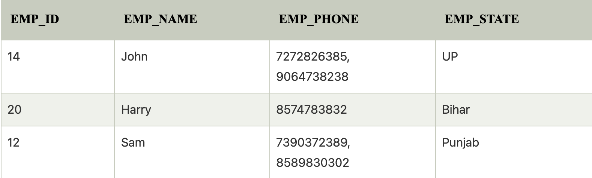
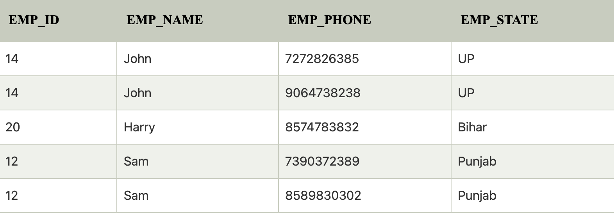
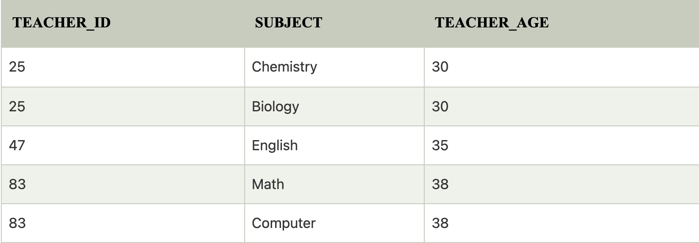
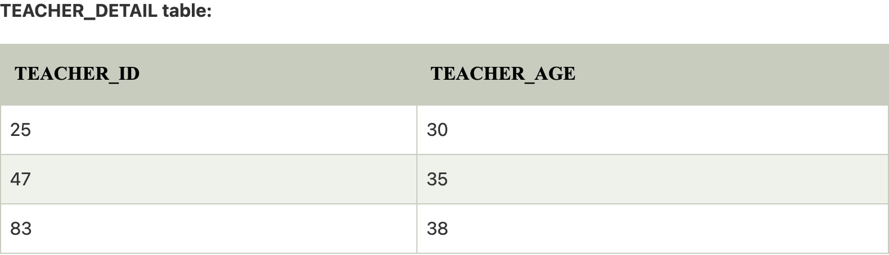
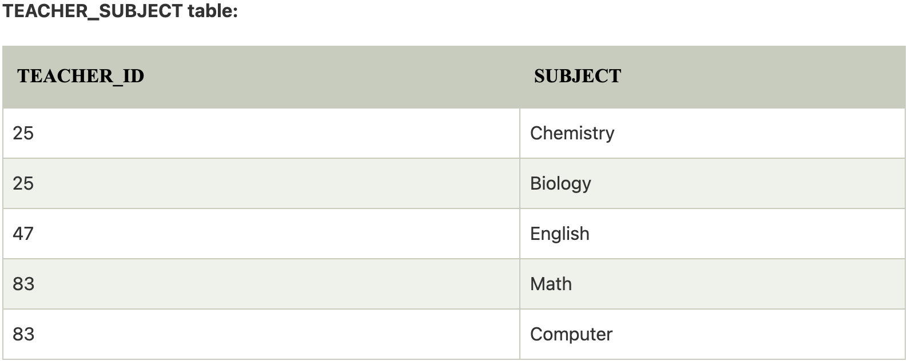
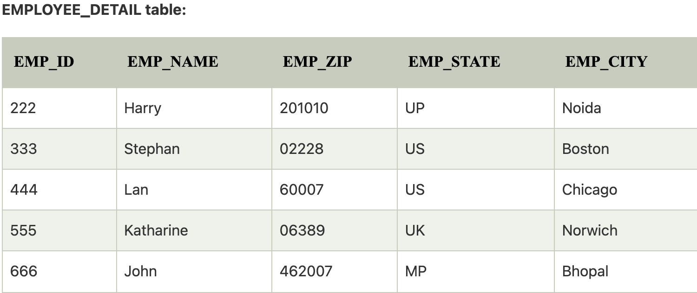
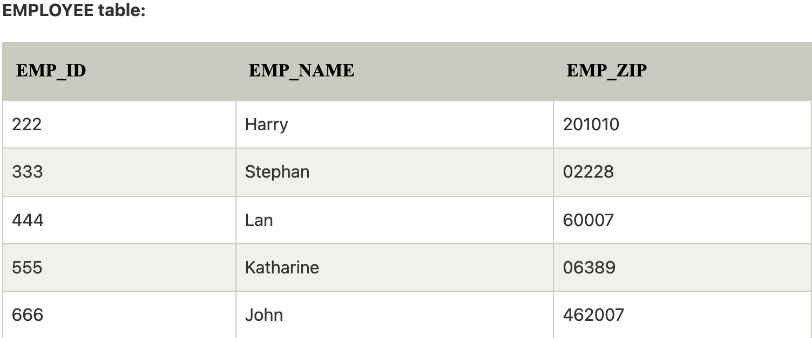
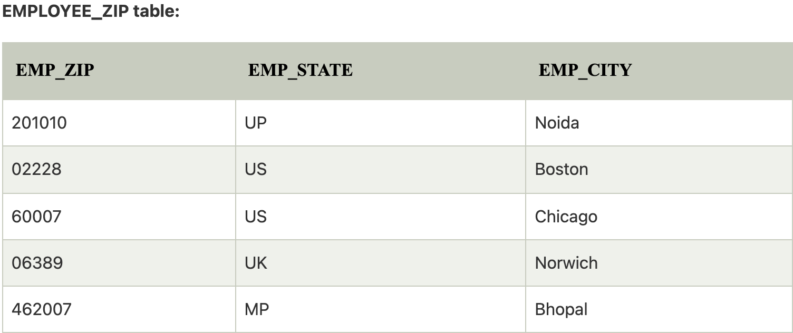

# Hafta 3

## Kodlama Kısmı

### Uygulamayı Ayağa Kaldırmadan Önce

Postgres ve Redis Docker Image'larını oluşturmak için terminalde aşağıdaki komutu çalıştırın:

```bash
sh infra-up.sh
```

Uygulamanın çalışmasını sonlandırdıktan sonra oluşturduğumuz Docker Image'leri aşağıdaki komutla kaldırmak isteyebilirsiniz:

```bash
sh infra-down.sh
```

Dosyalara okuma izni vermek için ise:

```bash
chmod +x ./infra-up.sh
```

komutunu çalıştırın.

### Swagger

Link: **<http://localhost:8080/swagger-ui/index.html>**

## Araştırma Kısmı

### 1. Imperative Programming ve Declarative Programming kavramlarını kısaca açıklayıp farklarını belirtiniz

Imperative Programming programın nasıl yürütüldüğünü açıklayan bir tür programlama paradigmasıdır. Geliştiriciler daha çok adım adım nasıl yanıt alınacağıyla ilgileniyor. Imperative komutlar dizisi içerir. Bu paradigmada yürütme sırası çok önemlidir ve hem mutable hem de immutable verileri kullanır. Fortran, Java, C, C++ programlama dilleri Imperative Programming örnekleridir.

Declarative Programming hangi programların yürütüleceğini açıklayan bir tür programlama paradigmasıdır. Geliştiriciler, alınan yanıtla daha fazla ilgilenir. Ne tür sonuçlar istediğimizi bildirir ve programlama dilini bir kenara bırakıp, sadece bunların nasıl üretileceğini bulmaya odaklanır. Basit bir deyişle, esas olarak nihai sonuca odaklanır. Hesaplamanın mantığını ifade eder. Miranda, Erlang, Haskell, Prolog, Declarative Programming'in birkaç örneğidir.

### 2. Veri tabanlarının sorgu optimizasyonlarında index oluşturmanın avantajı nedir ? Sık index kullanmak bir probleme yol açar mı?

SQL index özelliği kitaplardaki içindekiler sayfasına benzer. Kitaptaki bir konuyu bulmak için önce içindekiler sayfasına bakılır, konu bulunamazsa tüm kitap sayfalarına bakılır. Oluşturulan index tablo veya diğer veri tabanı nesneleri gibi görünmez sadece sorguları hızlandırmak için kullanılır.

Index veri tabanı sorgularını hızlandırmak için kullanılır. Veri tabanına yapılan her ekleme, güncelleme ve silme işleminden sonra index yeniden inşa edileceğinden fazla kullanılmayan sütunlar için index oluşturmak veya gereğinden fazla index oluşturmak performans düşürür.

### 3. İlişkisel veritabanları için normalizasyon kavramı neyi ifade etmektedir ? İlk 3 normal formu örnek üzerinden açıklayınız

Normalizasyon, veritabanlarındaki tabloların içeriğini organize etme tekniğidir. Başarılı veritabanı tasarımının bir parçasıdır. Normalizasyon olmadan, veritabanı sistemleri; yanlış, yavaş ve verimsiz olabilir ve beklediğiniz verileri üretmeyebilir.

Bir veri tabanının, veri tekrarını en aza indirgemek ve her tabloda yalnızca ilgili verilerin depolandığından emin olmak için normalleştirilmesi önemlidir. Bir tablo belirli bir konu hakkında olmalı ve sadece destekleyici konular içermelir.

#### 3.1. 1NF

Multi-valued attribute'a sahip sütunlar için kullanılan normalizasyon tekniğidir. Sütunlar single-valued attribute'a sahip olmalıdır.





#### 3.2. 2NF

Anahtar özelliğine sahip olmayan tüm sütunlar birincil anahtara tam bağımlı olmalı. Buna göre tablolar bölünmeli.



Verilen tabloda, TEACHER_AGE non-prime attribute'u candidate key'in uygun bir alt kümesi olan TEACHER_ID'ye bağlıdır. Bu yüzden 2NF kuralını ihlal ediyor.

Verilen tabloyu 2NF'ye dönüştürmek için onu iki tabloya ayırıyoruz.





#### 3.3. 3NF

Bir ilişki 2NF'teyse ve transition dependency'ye sahip değilse bu ilişki 3NF'e dönüştürülmelidir. Kısmi bağımlılık tamamen ortadan kaldırılmalıdır.







### 4. ORM kütüphaneleri kullanmak her zaman avantajlı mıdır ? ORM kütüphanelerinin ne gibi dezavantajları olabilir ?

**_ORM kullanmanın avantajları:_**

- Veri tabanı bağımsız olması en büyük avantajdır.

- SQL sorguları yazmaya gerek yoktur.

- Tablolar arasındaki bağımlılıklarla ilgilenir ve sorguları birleştirir.

- Bazı ORM library'leri önbelleğe alma desteğine sahiptir.Bu, veritabanındaki yükü azaltır ve yanıt süresini artırır.

- Transaction'ların commit edilmesini ve rollback edilmesini sağlar.

- Veritabanı connection pool'u sağlar.

- Concurrency desteği.

- Bakımın kolay olması ve üretkenliği arttırması.

**_ORM kullanmanın dezavantajları:_**

- ORM'ler her ne kadar işleri kolaylaştırsa da geliştiricilerin SQL ve database internal'larını öğrenmeyi geçiştirmesine sebep olur.

- ORM kullanımıyla ilgili bazı ek masraflar olacaktır. Veritabanına doğrudan erişilirse, geliştiriciler bir miktar kontrole sahip olurlar ve performansında ince ayar yapabilirler.

- ORM library'lerini anlamakla ilgili bir öğrenme eğrisi vardır. Java, .NET, PHP daha iyi ORM library'lerine sahiptir. .NET, dille tümleşik sorguyu kapsayan bir Framework olan LINQ desteğine sahiptir.

### 5. Domain Specific Language (DSL) kavramını açıklayınız

Programlama dilleri, özel (Domain Specific Language) ve genel (General Purpose Language) kapsamda kullanılan diller olarak ikiye ayrılabilir. DSL (Domain Specific Language), özel bir uygulama alanı için kullanılan dildir. DSL Örneği olarak web uygulaması geliştireceksiniz ve uygulamanın özel bir kapsamı olan tasarım konusunda CSS'i verebiliriz. Veri tabanı sorgularını yapmak için kullandığımız SQL'de DSL'e örnek olarak verilebilir çünkü belli bir sorunu çözmek için kullanılıyor.

### 6. Long lived transaction kavramı hangi tip transactionları ifade etmektedir ? Dezavantajları var mıdır ? Varsa nelerdir ?

Birden çok veritabanı transaction'ını kapsayan bir transaction'dır. Bu transaction uzun ömürlü olarak kabul edilir çünkü iş mantığı gereği sınırları tekli veri tabanı transaction'ı extend etmesi gerekir. Long lived transaction tek bir atomik sonuç elde etmek için gruplandırılmış bir veritabanı işlemleri dizisi olarak düşünülebilir.

Yaygın bir örnek, bir web client aracılığıyla bir kullanıcıyla etkileşimin çok adımlı bir request ve response dizisidir.

Long lived transaction, concurrency kontrolü ve ölçeklenebilirlik sorunları yaratır.

Long lived transaction'ların tasarımındaki en önemli strateji, versiyonlanmış optimistic concurrency kontrolüdür.

### 7. Thread Pool nedir ? Nerelerde kullanılır ?

Thread'ler işletim sisteminin kaynakları olan sistem düzeyindeki thread'lerle eşlenir. Kontrolsüz bir şekilde thread'ler oluşturursak, bu kaynakları hızla tüketebiliriz.

İşletim sistemi, paralelliği taklit etmek için thread'ler arasında bağlam geçişini de yapar. Basit düşünecek olursak ne kadar çok thread oluşturursak, her thread'in o andaki iş için o kadar az zaman harcadığıdır.

Thread Pool pattern'ı multithreaded bir uygulamada kaynakların korunmasına ve paralelliği önceden tanımlanmış belirli sınırlar içinde içermesine yardımcı olur.

Bir Thread Pool kullandığımızda, concurrent kodumuzu paralel görevler biçiminde yazarız ve bunları bir Thread Pool instance'ına yürütülmesi için göndeririz. Bu instance, bu görevleri yürütmek için yeniden kullanılan birkaç thread'i kontrol eder.

### 8. Scalability nedir ? Horizontal ve Vertical Scalability kavramlarını açıklayınız

Scalability bir uygulamanın ölçeklenebilirliğidir. Bir uygulamanın ölçeklenebilirliği, aynı anda etkin bir şekilde destekleyebileceği isteklerin sayısıyla ölçülebilir. Bir uygulamanın ek istekleri artık etkili bir şekilde işleyemediği nokta ise ölçeklenebilirliğinin sınırıdır. Bu sınıra, farklı veya daha fazla makine gerektiren kritik bir donanım kaynağı tükendiğinde ulaşılır. Bu kaynakların ölçeklendirilmesi, CPU ve fiziksel bellek (farklı veya daha fazla makine), sabit disk (daha büyük sabit sürücüler, daha az "canlı" veri, katı hal sürücüleri) ve/veya ağ bant genişliği (çoklu ağ arabirim denetleyicileri) için herhangi bir ayarlama kombinasyonunu içerebilir.

Horizontal scaling ve Vertical scaling, infrastructure'a bilgi işlem kaynakları eklemeyi içermeleri bakımından benzerdir. İkisi arasında uygulama ve performans açısından belirgin farklılıklar vardır.

Horizontal scaling, kaynak havuzunuza daha fazla makine ekleyerek ölçeklendirme anlamına gelir ("scaling out" olarak da tanımlanır), vertical scaling ise mevcut bir makineye daha fazla güç (örn. CPU, RAM) ekleyerek ("scaling up" olarak da tanımlanır) ölçeklendirme anlamına gelir. ”).

### 9. Data replication ve sharding nedir ? Aralarında nasıl bir fark bulunmaktadır ?

Bir replica, tam bir kopyadır. Replication'daki amaç, hem primary hem de slave üzerinde aynı veri kümesine sahip olmaktır.

Sharding ise segmentasyondur. Veri seti shard'lara bölünür ve farklı node'larda tutulur. Bu veri bölümü, farklı algoritmalara dayalı olarak gerçekleştirilir.

Örneğin, DB'de üç tablo olduğunu varsayalım: A, B ve C. Bir replika oluşturdum. Hem primary hem de replica (slave) node'u üç tablonun tümüne sahip olacak.

Sharding durumunda 3 adet shard node'umuz olduğunu varsayalım. Node 1'de A ve B tablosu, node 2'de B ve C tablosu ve node 3'te C ve A tablosu bulunur.

Replica durumunda, primary öğe bozulursa, replica yeni primary olmak üzere yükseltilebilir.

3 shard'dan birinin arızalanması durumunda, diğer ikisinde veriler korunur ve bu nedenle (node'ların yeterli kaynağa sahip olması koşuluyla) veritabanı etkinliklerinde herhangi bir kesinti olmaz.

Replikasyon durumunda replika üzerinde bir sorgu başlattığınızda sadece replikanın CPU ve RAM'i kullanılacaktır. Ancak, sharding durumunda, veriler farklı shard'lardan birine toplanacak, bir bütün olarak işlenecek ve daha sonra çıktı olarak verilecektir.
