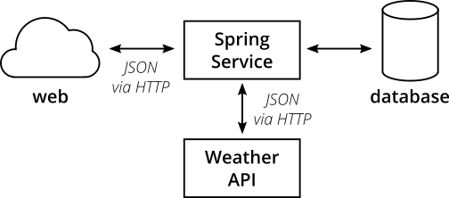

# The Practical Test Pyramid

"Test Piramidi", yazılım testlerini farklı ayrıntı düzeyine sahip bucket'lar halinde gruplandırmamızı söyleyen bir metafordur. Ayrıca bu grupların her birinde kaç tane teste sahip olunması gerektiğine dair bir fikir verir. Test Piramidi kavramı bir süredir ortalarda olmasına rağmen ekipler hala onu doğru bir şekilde uygulamaya koymakta zorlanıyor. Bu makale Test Piramidinin orijinal konseptini yeniden gözden geçirmekte ve bunu nasıl uygulamaya koyabileceğinizi göstermektedir. Piramidin farklı seviyelerinde ne tür testlere bakmamız gerektiğini gösterir ve bu testlerin nasıl uygulanabileceğine dair pratik örnekler verir.

Production-ready olan her yazılım production'a geçmeden evvel test edilmelidirler. Yazılım geliştirme disiplini olgunlaştıkça, yazılım test yaklaşımları da olgunlaştı. Geliştirme ekipleri, sayısız manuel yazılım test uzmanına sahip olmak yerine, test için harcadıkları çabalarının en büyük bölümünü otomatikleştirmeye yöneltti. Testlerini otomatikleştirmek ekiplerin yazılımlarının bozulup bozulmadığını günler ve haftalar yerine, saniyeler ve dakikalar içinde bilmelerini sağlar.

Otomatikleştirilmiş testlerin körüklediği büyük ölçüde kısaltılmış geri bildirim döngüsü, agile development pratikleri, continuous delivery ve DevOps kültürü ile el ele gider. Etkili bir yazılım testi yaklaşımına sahip olmak, ekiplerin hızlı ve güvenle hareket etmelerini sağlar.

Bu makale, ister bir microservice mimarisi, ister mobil uygulamalar veya IoT ekosistemleri oluşturuyor olun, duyarlı, güvenilir ve sürdürülebilir olmak için çok yönlü bir test portföyünün nasıl görünmesi gerektiğini araştırıyor. Ayrıca etkili ve okunabilir otomatik testler oluşturmanın ayrıntılarına da gireceğiz.

## (Test) Otomasyonunun Önemi

Yazılım, içinde yaşadığımız dünyanın önemli bir parçası haline geldi. İlk amacı olan işletmeleri daha verimli hale getirme amacının ötesine geçti. Günümüzde şirketler birinci sınıf dijital şirketler olmanın yollarını bulmaya çalışıyor. Kullanıcılar olarak hepimiz her gün giderek artan miktarda yazılımla etkileşime giriyoruz. İnovasyon çarkları daha hızlı dönüyor.

Hızınızı korumak istiyorsanız, yazılımınızı kaliteden ödün vermeden daha hızlı sunmanın yollarını aramanız gerekir. Yazılımınızın her an production'a geçebilmesine olanak sağlayan Continuous Delivery bu konuda size yardımcı olabilir. Continuous Delivery ile yazılımınızı otomatik olarak test etmek ve test ve production ortamlarınıza aktarmak için bir build pipeline kullanırsınız.

Çalışan yazılımlar sunmak yerine tüm zamanınızı manuel, tekrarlayan işlerle geçirmek isterseniz, sürekli artan miktarda yazılımı manuel olarak oluşturmak, test etmek ve dağıtmak zamanla imkansız hale gelir. Build'den test'lere, deployment'a ve infrastructure'a kadar her şeyi otomatikleştirmek, ileriye dönük tek yolunuzdur.

Geleneksel olarak yazılım testi, uygulamanızı bir test ortamına aktarılarak ve ardından black-box stili ve benzeri stiller ile herhangi bir şeyin bozuk olup olmadığını görmek için kullanıcı arayüzünüze tıklayarak yapılan manuel bir işti. Genellikle bu testler, test edenlerin tutarlı kontrol yapmasını sağlamak için test komut dosyaları tarafından belirtilir.

Tüm değişiklikleri manuel olarak test etmenin zaman alıcı, tekrarlayan ve sıkıcı olduğu açıktır. Tekrarlar sıkıcıdır, sıkıcı hatalara yol açar ve hafta sonuna kadar farklı bir iş aramanıza neden olur.

Neyse ki tekrarlayan görevler için bir çare var: otomasyon.

Tekrarlayan testlerinizi otomatikleştirmek, bir yazılım geliştiricisi olarak hayatınızda büyük bir oyun değiştirici olabilir. Testleri otomatikleştirmek, artık yazılımınızın doğru çalıştığını kontrol etmek için tıklama protokollerini akılsızca takip etmenize gerek bırakmıyor. Testlerinizi otomatikleştirin ve kod tabanınızı gözünüze batmadan değiştirebilin. Uygun bir test takımı olmadan büyük ölçekli bir yeniden düzenleme yapmayı denediyseniz, bahse girerim bunun ne kadar korkunç bir deneyim olabileceğini biliyorsunuzdur. Yolda yanlışlıkla bir şeyler kırıp kırmadığınızı nasıl anlarsınız? Pekala, tüm manuel test case'lerinize tıklarsınız, işte böyle. Ama dürüst olalım: Bundan gerçekten hoşlanıyor musunuz? Güzel bir kahve yudumlarken, büyük çaplı değişiklikler bile yapmaya ve saniyeler içinde bir şeyleri kırıp kırmadığınızı bilmeye ne dersiniz? Bana sorarsan kulağa daha zevkli geliyor.

## Test Piramidi

Yazılımınız için otomatik testler konusunda ciddi olmak istiyorsanız, bilmeniz gereken bir anahtar kavram vardır: test piramidi. Mike Cohn, Succeeding with Agile adlı kitabında bu kavramı ortaya attı. Bu farklı test katmanları üzerine düşünmenizi söyleyen harika bir görsel metafor. Ayrıca her katmanda ne kadar test yapmanız gerektiğini üzerinde de durur.

Mike Cohn'un orijinal test piramidi, test takımınızın (aşağıdan yukarıya) içermesi gereken üç katmandan oluşur:

- Unit Test'ler
- Service Test'ler
- UI Test'ler

Ne yazık ki, daha yakından bakarsanız, test piramidi kavramı biraz yetersiz kalıyor. Bazıları, Mike Cohn'un test piramidinin adının veya bazı kavramsal yönlerinin ideal olmadığını iddia ediyor ama buna katılıyorum. Modern bir bakış açısından, test piramidi aşırı derecede basit görünüyor ve bu nedenle yanıltıcı olabilir.

Yine de, basitliği nedeniyle, kendi test takımınızı oluşturmaya gelince, test piramidinin özü iyi bir temel kural olarak hizmet eder. En iyi iddianız, Cohn'un orijinal test piramidinden iki şeyi hatırlamaktır:

- Farklı ayrıntı düzeyine sahip testler yazın
- Ne kadar yüksek seviye alırsanız, o kadar az test yaptırmanız gerekir

Sağlıklı, hızlı ve bakımı kolay bir test paketi bulmak için piramit şekline bağlı kalın: Çok sayıda küçük ve hızlı birim testi yazın. Uygulamanızı uçtan uca test eden daha kaba testler ve çok az sayıda üst düzey test yazın. Bakımı bir kabus olacak ve çalıştırması çok uzun süren bir test ile sonuçlanmadığına dikkat edin.

Cohn'un test piramidindeki katmanların adlarına fazla bağlı kalmayın. Aslında oldukça yanıltıcı olabilirler: Service Test, kavraması zor bir terimdir (Cohn, birçok geliştiricinin bu katmanı tamamen görmezden geldiği gözleminden bahseder). React, Angular, Ember.js ve diğerleri gibi single page application framework'lerinin olduğu günlerde, UI test'lerinin piramidinizin en üst seviyesinde olması gerekmediği açıkça ortaya çıkıyor, bu framework'lerin tümünde UI'ınızı mükemmel bir şekilde test edebilirsiniz.

Orijinal adların eksiklikleri göz önüne alındığında, kod tabanınız ve ekibinizin tartışmaları içinde tutarlı tuttuğunuz sürece, test katmanlarınız için başka adlar bulmakta sorun yoktur.

## İnceleyeceğimiz Tool'lar ve Library'ler

- JUnit: test yürütücümüz
- Mockito: bağımlılıkları mock'lamak için
- Wiremock: server mock'lamak için
- Pact: CDC testleri yazmak için
- Selenium: UI odaklı uçtan uca testler yazmak için
- REST-assured: REST API'ye dayalı uçtan uca testler yazmak için

## Örnek Uygulama

Test piramidinin farklı katmanları için testlerin bulunduğu bir test takımı içeren basit bir microservice yazdım.

Örnek uygulama, tipik bir microservice'in özelliklerini gösterir. Bir REST arabirimi sağlar, bir veritabanıyla konuşur ve third-party bir REST servisinden bilgi alır. Spring Boot'da uygulanır ve daha önce Spring Boot ile hiç çalışmamış olsanız bile anlaşılabilir olmalıdır.

### Fonksiyonalite

Uygulamanın işlevselliği basittir. Üç uç nokta ile bir REST arayüzü sağlar:

- `GET /hello` "Hello World" geri döndürür.
- `GET /hello/{lastname}` lastname'i verilmiş kişiye bakar. Eğer biliniyorsa "Hello {Firstname} {Lastname}" döndürür.
- `GET /weather` Almanya, Hamburg için anlık hava durumunu döndürür.

### Üst Düzey Yapı

Yüksek düzeyde sistem aşağıdaki yapıya sahiptir:

Microservice, HTTP aracılığıyla çağrılabilen bir REST arabirimi sağlar. Bazı endpointler için servis, bir veritabanından bilgi alacaktır. Diğer durumlarda servis, mevcut hava koşullarını almak ve görüntülemek için HTTP aracılığıyla harici bir hava durumu API'sini çağıracaktır.

### İç Mimari

Dahili olarak, Spring Service, Spring'e özgü bir mimariye sahiptir:

- Controller sınıfları, REST uç noktaları sağlar ve HTTP istekleri ve yanıtlarıyla ilgilenir

- Repository sınıfları, veritabanı ile arayüz oluşturur ve kalıcı depoya/kalıcı depodan veri yazma ve okuma ile ilgilenir

- Client sınıfları diğer API'lerle konuşur, bizim durumumuzda darksky.net hava durumu API'sinden HTTPS aracılığıyla JSON'u getirir.

- Domain sınıfları, etki alanı mantığı dahil (adil olmak gerekirse, bizim durumumuzda oldukça önemsiz olan) etki alanı modelimizi yakalar.

Deneyimli Spring geliştiricileri, burada sık kullanılan bir katmanın eksik olduğunu fark edebilir: Domain-Driven Design'dan ilham alan birçok geliştirici, hizmet sınıflarından oluşan bir servis katmanı oluşturur. Bu uygulamaya servis katmanı eklememeye karar verdim. Bunun bir nedeni, uygulamamızın yeterince basit olmasıdır, bir servis katmanı gereksiz bir dolaylılık düzeyi olurdu. Diğeri ise, insanların bunu servis katmanlarıyla abarttığını düşünüyorum. Tüm iş mantığının servis sınıfları içinde yakalandığı kod tabanlarıyla sık sık karşılaşıyorum. Domain Model, davranış için değil, yalnızca veri için bir katman haline gelir (bir Anemik Domain Modeli). Önemsiz olmayan her uygulama için bu, kodunuzu iyi yapılandırılmış ve test edilebilir tutma potansiyelini boşa harcar ve nesne yöneliminin gücünü tam olarak kullanmaz.

Repository'ler basittir ve basit CRUD işlevselliği sağlar. Kodu basit tutmak için Spring Data kullandım. Spring Data bize, kendimizinkini sarmalamamız yerine kullanabileceğimiz basit ve genel bir CRUD deposu uygulaması sunar. Ayrıca, production'da olduğu gibi gerçek bir PostgreSQL veritabanı kullanmak yerine, testlerimiz için bir in-memory veritabanını döndürmekle ilgilenir.

Kod tabanına bir göz atın ve iç yapıya aşina olun. Bir sonraki adımımız için faydalı olacak: Uygulamayı test etmek!

### Unit Testler

Test suite'inin temeli, unit testlerden oluşacaktır. Unit testleriniz, kod tabanınızın belirli bir biriminin (test edilen konunuz) amaçlandığı gibi çalıştığından emin olur. Unit testleri, test suite'inizdeki tüm testlerin en dar kapsamına sahiptir. Test suite'inizdeki birim testlerinin sayısı, diğer test türlerinden büyük ölçüde daha fazla olacaktır.

#### Birim nedir?

Üç farklı kişiye birim testleri bağlamında "birim"in ne anlama geldiğini sorarsanız, muhtemelen dört farklı, biraz nüanslı yanıt alırsınız. Bir dereceye kadar, bu sizin kendi tanımınızla ilgili bir meseledir ve kanonik bir cevaba sahip olmamakta bir sorun yoktur.

Fonksiyonel bir dilde çalışıyorsanız, bir birim büyük olasılıkla tek bir fonksiyon olacaktır. Birim testleriniz, farklı parametrelere sahip bir fonksiyonu çağıracak ve beklenen değerleri döndürmesini sağlayacaktır. Nesne yönelimli bir dilde bir birim, tek bir yöntemden tüm bir sınıfa kadar değişebilir.

#### Sosyal ve Yalnız

Bazıları, mükemmel bir izolasyon elde etmek ve yan etkilerden ve karmaşık bir test kurulumundan kaçınmak için test edilen konunuzun tüm ortak çalışanlarının (örneğin, test edilen sınıfınız tarafından çağrılan diğer sınıflar) sahte veya taslaklarla değiştirilmesi gerektiğini savunuyor. Diğerleri, yalnızca yavaş veya daha büyük yan etkileri olan ortak çalışanların (örneğin, veritabanlarına erişen veya ağ aramaları yapan sınıflar) saplanması veya alay edilmesi gerektiğini savunuyor.

Bazen insanlar bu iki tür testi, tüm ortak çalışanları saplayan testler için tek birim testleri ve gerçek ortak çalışanlarla konuşmaya izin veren testler için sosyal birim testleri (bu terimleri Jay Fields'ın Birim Testleriyle Etkili Çalışması) olarak etiketler. Boş zamanınız varsa, tavşan deliğine inebilir ve farklı düşünce okullarının artıları ve eksileri hakkında daha fazla bilgi edinebilirsiniz.

Günün sonunda, yalnız mı yoksa sosyal birim testleri mi yapacağınıza karar vermek önemli değil. Önemli olan otomatik testler yazmaktır. Şahsen, kendimi her zaman her iki yaklaşımı da kullanırken buluyorum. Gerçek işbirlikçileri kullanmak garip hale gelirse, taklitleri ve taslakları cömertçe kullanacağım. Gerçek işbirlikçiyi dahil etmek bana bir testte daha fazla güven veriyorsa, hizmetimin yalnızca en dış kısımlarını saplayacağım.
