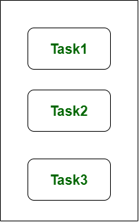

# Hafta 5

## Araştırma Ödevi

### 1. Concurrent programlama ve Parallel Programlama nedir ? Aralarında çalışma şekli olarak nasıl bir fark bulunmaktadır ?

#### 1.1. Concurrency

Concurrency, aynı anda birden fazla görevi işleyen bir uygulama ile ilgilidir. Concurrency, single processing unit kullanılarak sistemin yanıt süresini azaltmak için kullanılan bir yaklaşımdır. Concurrency parallelism yanılsaması yaratır ama aslında bir task'ın parçaları paralel olarak işlenmez. Uygulamanın içinde aynı anda birden fazla task işlenir. Devam etmeye başlamadan önce bir task'ı tamamen bitirmez.

Concurrency, Central Processing Unit (CPU) üzerindeki process'lerin serpiştirilmesiyle veya başka bir deyişle context değiştirmeyle sağlanır. Bu parallel processing gibi bir mantık. Bir seferde tamamlanan iş miktarını artırır.



Yukarıdaki şekilde, aynı anda ilerleme gösteren birden fazla task olduğunu görebiliriz. Bu şekil concurrency'yi gösterir, çünkü concurrency aynı anda birçok task ile ilgilenme tekniğidir.

#### 1.2. Parallelism

Parallelism, task'ların görünüşte aynı anda, yani paralel olarak işlendiği, daha küçük alt task'lara bölündüğü bir uygulama tekniğidir. Birden fazla işlemci kullanarak sistemin verimini ve hesaplama hızını artırmak için kullanılır. Single Sequential CPU'ların aynı anda birçok şeyi "görünüşte" yapmasını sağlar.

Parallelism, bir process'teki CPU'ların ve input-output task'larının başka bir process'in CPU'su ve input-output task'larının ile örtüşmesine yol açar. Concurrency'de ise bir işlemin input-output aktivitelerinin başka bir işlemin CPU işlemiyle örtüşmesiyle hız artırılır.


Yukarıdaki şekilde, task'ların aynı anda veya paralel olarak işlenen daha küçük alt task'lara bölündüğünü görebiliriz. Bu şekil, thread'leri simultane çalıştıran teknik olan parallelism'i göstermektedir.

### 2. Mutex ve Semaphore kavramlarını açıklayınız. Hangi tür durumlarda bunlara başvurmamız gerekir ?

İşletim sistemi terminolojisine göre, Mutex'ler ve Semaphore'lar, senkronizasyon servisleri sağlayan kernel resource'larıdır (synchronization primitive'leri olarak da adlandırılır). Bu kavramları iyi anlamak için örnekler kullanalım.

#### 2.1. [Producer-Consumer](https://en.wikipedia.org/wiki/Producer%E2%80%93consumer_problem) Problemi

Standart bir producer-consumer problemini düşünün. 4096 bayt uzunluğunda bir buffer olduğunu varsayalım. Bir producer thread verileri toplar ve buffer'a yazar. Bir consumer thread buffer'dan toplanan verileri işler. Amaç, her iki thread'in aynı anda çalışmamasıdır.

#### 2.2. Mutex Kullanarak

Bir Mutex, karşılıklı exclusion sağlar, producer veya consumer anahtara (mutex) sahip olabilir ve çalışmalarına devam edebilir. Buffer, producer tarafından doldurulduğu sürece, consumer'ın beklemesi gerekir ve bunun tersi de geçerlidir.

Herhangi bir zamanda, tüm buffer'da yalnızca bir thread çalışabilir. Bu konsept Semaphore kullanılarak genelleştirilebilir.

#### 2.3. Semaphore Kullanarak

Bir Semaphore, genelleştirilmiş bir Mutex'tir. Tek bir buffer yerine, 4 KB buffer'ı dört adet 1 KB buffer'a (aynı kaynaklar) bölebiliriz. Bu dört buffer bir Semaphore ilişkilendirilebilir. Consumer ve producer aynı anda farklı buffer'lar üzerinde çalışabilir.

#### 2.4. Yanlış Kanı

Binary Semaphore ve Mutex arasında bir belirsizlik vardır. Bir Mutex'in binary bir Semaphore olduğuyla karşılaşmış olabiliriz. Ama öyle değil! Mutex ve Semaphore'un amacı farklıdır. Belki implamantasyonlarındaki benzerlik nedeniyle bir Mutex, binary Semaphore olarak anılacaktır.

Mutex, bir resource'a erişimi senkronize etmek için kullanılan bir locking mekanizmasıdır. Yalnızca bir task (bir thread veya işletim sistemi soyutlamasına dayalı bir işlem olabilir) Mutex alabilir. Bu, bir Mutex ile ilişkili sahiplik olduğu ve yalnızca sahibin kilidi (Mutex) serbest bırakabileceği anlamına gelir.

Semaphore, bir signaling mekanizmasıdır (“Bitirdim, devam edebilirsiniz” türünden bir sinyal). Örneğin, cep telefonunuzda şarkı dinliyorsanız (bunu tek bir görev olarak kabul edin) ve aynı zamanda arkadaşınız sizi ararsa, bir Interrupt Service Routine (ISR) call processing task'a sinyal vermesi üzerine bir uyandırma interrupt'ı tetiklenir.

### 3. Java’da Error ve Exception arasındaki fark nedir ? Throwable ile ilişkileri nasıldır ? Hangi tür durumlarda Error hangi tür durumlarda Exception meydana gelebilir ? Örneklerle açıklayınız

java.lang.Throwable class'ı Java'daki tüm error'ların ve exception'ların superclass'ıdır. Sadece bu class'ın ya da bu class'ın subclass'larının instance'ı olan object'ler Java Virtual Machine tarafından ya da Java throw statement'ı tarafından fırlatılabilir.

Error, esas olarak sistem kaynaklarının eksikliğinden kaynaklanan bir sorunu gösterir ve uygulamamız bu tür sorunları yakalamamalıdır. Error örneklerinden bazıları system crash error ve out of memory error'udur. Error'lar çoğunlukla kontrol edilmeyen bir türe ait oldukları için runtime'da meydana gelir.

Exception'lar, runtime'da ve compile time'da oluşabilecek problemlerdir. Esas olarak geliştiriciler tarafından yazılan kodda oluşur. Exception'lar, kontrol edilen checked ve unchecked exception'lar gibi iki kategoriye ayrılır.

| No  | Key                         | Error                     | Exception                                         |
| --- | --------------------------- | ------------------------- | ------------------------------------------------- |
| 1   | Type                        | Unchecked                 | Checked ve Unchecked                              |
| 2   | Package                     | java.lang.error           | java.lang.Exception                               |
| 3   | Recoverable / Irrecoverable | Irrecoverable             | Recoverable                                       |
| 4   |                             | Compile Time'da oluşmaz   | Hem Runtime'da hem de Compile Time'da oluşabilir. |
| 5   | Example                     | OutOfMemoryError, IOError | NullPointerException, SqlException                |

### 4. Spring’te yer alan @Scheduled anotasyonunun kullanım amaçlarını ve kullanım şeklini açıklayınız

Scheduling, belirli bir zaman dilimi için görevleri yürütme sürecidir. Spring Boot, Spring uygulamalarına bir zamanlayıcı yazmak için iyi bir destek sağlar.

#### 4.1. Java Cron Expression

Java Cron expression'lar, `org.quartz.Trigger` öğesinin bir alt sınıfı olan `CronTrigger` örneklerini yapılandırmak için kullanılır.

`@EnableScheduling` anotasyonu ile uygulamada zamanlayıcı etkinleştirilir.

```java
@SpringBootApplication
@EnableScheduling
public class DemoApplication {
   public static void main(String[] args) {
      SpringApplication.run(DemoApplication.class, args);
   }
}
```

`@Scheduled` anotasyonu ile zamanlayıcıyı spesifik bir zamanda tetiklemek için kullanılır.

```java
@Scheduled(cron = "0 * 9 * * ?")
public void cronJobSch() throws Exception {
}
```

Aşağıdaki örnek kod her gün 9:00 am ile 9:59 am arasında dakika başı task'ı execute eder.

```java
package com.tutorialspoint.demo.scheduler;

import java.text.SimpleDateFormat;
import java.util.Date;
import org.springframework.scheduling.annotation.Scheduled;
import org.springframework.stereotype.Component;

@Component
public class Scheduler {
   @Scheduled(cron = "0 * 9 * * ?")
   public void cronJobSch() {
      SimpleDateFormat sdf = new SimpleDateFormat("yyyy-MM-dd HH:mm:ss.SSS");
      Date now = new Date();
      String strDate = sdf.format(now);
      System.out.println("Java cron job expression:: " + strDate);
   }
}
```

#### 4.2. Fixed Rate

Fixed Rate zamanlayıcısı task'ları spesifik bir zamanda çalıştırır. Önceki task'ın tamamlanması beklenmez. Alacağı değerler milisaniye cinsindendir.

```java
@Scheduled(fixedRate = 1000)
public void fixedRateSch() {
}
```

Örnek kod uygulama çalıştığından itibaren her saniye task'ı execute eder.

```java
package com.tutorialspoint.demo.scheduler;

import java.text.SimpleDateFormat;
import java.util.Date;
import org.springframework.scheduling.annotation.Scheduled;
import org.springframework.stereotype.Component;

@Component
public class Scheduler {
   @Scheduled(fixedRate = 1000)
   public void fixedRateSch() {
      SimpleDateFormat sdf = new SimpleDateFormat("yyyy-MM-dd HH:mm:ss.SSS");

      Date now = new Date();
      String strDate = sdf.format(now);
      System.out.println("Fixed Rate scheduler:: " + strDate);
   }
}
```

#### 4.3. Fixed Delay

Fixed Delay zamanlayıcısı task'ları spesifik bir zamanda çalıştırır. Önceki task'ın tamamlanmasını bekler. Alacağı değerler milisaniye cinsindendir.

```java
@Scheduled(fixedDelay = 1000, initialDelay = 1000)
public void fixedDelaySch() {
}
```

Aşağıdaki örnek kodda uygulama başlangıcından 3 saniye sonra her saniye task'ı execute eder.

```java
package com.tutorialspoint.demo.scheduler;

import java.text.SimpleDateFormat;
import java.util.Date;
import org.springframework.scheduling.annotation.Scheduled;
import org.springframework.stereotype.Component;

@Component
public class Scheduler {
   @Scheduled(fixedDelay = 1000, initialDelay = 3000)
   public void fixedDelaySch() {
      SimpleDateFormat sdf = new SimpleDateFormat("yyyy-MM-dd HH:mm:ss.SSS");
      Date now = new Date();
      String strDate = sdf.format(now);
      System.out.println("Fixed Delay scheduler:: " + strDate);
   }
}
```

### 5. Spring’te yer alan @Async anotasyonunun kullanım amaçlarını ve kullanım şeklini açıklayınız

@Async ile annotate edilmiş bir bean method'u ayrı bir thread'de yürütülür. Caller, bu called method'un tamamlanmasını beklemez.

#### 5.1. @EnableAsync İle Async Desteğinin Etkinleştirilmesi

Configuration class'a `@EnableAsync` anotasyonu eklenerek async processing etkinleştirilir.

```java
@Configuration
@EnableAsync
public class ApplicationConfiguration {
  //additional configurations
}
```

`@EnableAsync` anotasyonu ile async processing etkinleştirilir.

#### 5.2. Spring @Async Anotasyonu

Async yapmak istediğimiz method'a `@Async` anotasyonu eklenir. Bu method'un proxy'lenebilmesi için public olması gerekmektedir ve self-invocation çalışmaz çünkü proxy'yi bypass eder. Method return tipi `CompletableFuture` veya `Future` olmalı eğer `void` değilse.

```java
@Async
public void updateCustomer(Customer customer) {
 //long running background process.
}
```

#### 5.3. @Async nasıl çalışır?

@Async'i bir yönteme eklediğimizde, yay çerçevesi proxyTargetClass özelliğine dayalı bir proxy oluşturur. Bu yönteme gelen bir istek için.

- Spring, context ile ilişkili bir thread pool bulmaya çalışır. Request'i ayrı bir thread'de göndermek ve main thread'i serbest bırakmak için bu thread pool'u kullanır.
- Spring, TaskExecutor bean'i veya taskExecutor adlı bir bean'i arayacaktır, aksi takdirde SimpleAsyncTaskExecutor'a geri dönecektir.

@Async anotasyonunu uygulayabileceğimiz 2 varyasyona bakalım.

##### 5.3.1. Void Döndüren Method

Method `void` döndüren bir method ise ek bir işlem yapmamıza gerek yok. Spring otomatik olarak ayrı bir thread başlatacaktır.

```java
@Async
 public void updateCustomer(Customer customer) {
     // run the background process
}
```

##### 5.3.2. Geri Dönüş Tipine Sahip Method

Geri dönüş tipine sahip method'lar mutlaka `CompletableFuture` veya `Future` ile wrap edilmelidir.

```java
@Async
public CompletableFuture getCustomerByID(final String id) throws InterruptedException {
    //run the process
    return CompletableFuture.completedFuture(customer);
}
```

#### 5.4. Executor

Spring, background işlemlerinde thread'i yönetmek için bir thread pool'a ihtiyaç duyar. TaskExecutor bean veya TaskExecutor adlı bir bean arayacaktır. SimpleAsyncTaskExecutor'a geri dönecek. Bazen, thread pool davranışını ihtiyacımıza göre özelleştirmemiz gerekebilir, Spring, executor'ı özelleştirmek için aşağıdaki 2 seçeneği sunar.

- Executor'ı method düzeyinde override edin.
- Uygulama seviyesi

Çoğu durumda, custom executor'ı yöntem düzeyinde kullanırız. İki seçeneğe bakmadan önce, özel executor bean oluşturalım.

```java
@Bean(name = "threadPoolTaskExecutor")
public Executor asyncExecutor() {
   ThreadPoolTaskExecutor executor = new ThreadPoolTaskExecutor();
   executor.setCorePoolSize(4);
   executor.setMaxPoolSize(4);
   executor.setQueueCapacity(50);
   executor.setThreadNamePrefix("AsynchThread::");
   executor.initialize();
   return executor;
}
```

##### 5.4.1. Method Seviyesindeki Executor

```java
@Async("threadPoolTaskExecutor")
public CompletableFuture < Customer > getCustomerByID(final String id) throws InterruptedException {
 //background or long running process
}
```

##### 5.4.2. Uygulama Seviyesinde Executor'ı Override Et

Configuration class'a `AsyncConfigurer` interface'ini implement ederek custom executor'ı uygulama seviyesinde kullanabiliriz.

```java
@Configuration
public class ServiceExecutorConfig implements AsyncConfigurer {

 @Override
 public Executor getAsyncExecutor() {
  ThreadPoolTaskExecutor taskExecutor = new ThreadPoolTaskExecutor();
  taskExecutor.setCorePoolSize(4);
  taskExecutor.setMaxPoolSize(4);
  taskExecutor.setQueueCapacity(50);
  taskExecutor.initialize();
  return taskExecutor;
 }
}
```

##### 5.4.3. Birden Çok ThreadPoolTaskExecutors

Farklı bir task için farklı ThreadPoolTaskExecutor'a sahip olmak istemeniz durumunda, birden çok executor bean tanımlayabilirsiniz.

```java
@Configuration
@EnableAsync
public class ApplicationConfiguration {

 @Bean(name = "threadPoolTaskExecutor1")
 public Executor executor1() {
  ThreadPoolTaskExecutor executor = new ThreadPoolTaskExecutor();
  executor.setCorePoolSize(4);
  executor.setMaxPoolSize(4);
  executor.setQueueCapacity(50);
  executor.setThreadNamePrefix("CustomExecutor1::");
  executor.initialize();
  return executor;
 }

 @Bean(name = "threadPoolTaskExecutor2")
 public Executor executor2() {
  ThreadPoolTaskExecutor executor = new ThreadPoolTaskExecutor();
  executor.setCorePoolSize(4);
  executor.setMaxPoolSize(4);
  executor.setQueueCapacity(50);
  executor.setThreadNamePrefix("CustomExecutor2::");
  executor.initialize();
  return executor;
 }
}
```

Bunları aşağıdaki gibi kullanabiliriz:

```java
@Async("threadPoolTaskExecutor1")
public void methodA() {}

@Async("threadPoolTaskExecutor2")
public void methodB() {}
```

### 6. High Availability (HA) kavramını kısa açıklayınız

Yüksek kullanılabilirlik (High Availability), bir IT sisteminin, bileşeninin veya uygulamasının belirli bir süre boyunca müdahale olmaksızın sürekli olarak yüksek düzeyde çalışabilmesi anlamına gelir. Yüksek kullanılabilirlik altyapısı, kaliteli performans sağlamak ve minimum veya sıfır kesinti süresi ile farklı yükleri ve arızaları ele almak üzere yapılandırılmıştır.

### 7. Entity ve Value Object kavramlarını Domain Driven Design (DDD) kapsamında açıklayınız

Belirli bir kimliğe sahip olan ve öncelikle onun tarafından tanımlanan bir nesneye Entity denir. Bir alan kavramını, bireyselliği ilkel olduğunda ve sistemdeki diğer nesnelerden ayırt edilmesi gerektiğinde bir Entity olarak modelleriz. Entity'lerde, yaşam döngüleri boyunca büyük ölçüde değişebilecekleri, ancak benzersiz bir şekilde tanımlanabilecekleri için bir süreklilik kavramı vardır.

Entity'lerin, adlarından da anlaşılacağı gibi, tanımlanabilir bir gerçek dünya kavramına bağlı olmaları gerekmez. Attribute'lardan bağımsız olarak sistemde izlenmesi gereken herhangi bir şey olabilirler.

Bir Entity tasarlarken, öncelikle kimliğine katkıda bulunan birincil niteliklerine ve davranışlarına odaklanılmalıdır. Özellikle DDD'ye yeni başlayanlar için verilere odaklanma ve bir etki alanı nesnesinin tüm özelliklerini tanımlama eğilimi vardır. Bu, Entity kimliğinin tüm yönleri değerlendirilip karara bağlanana kadar ertelenmelidir. Önce kimliğin nasıl elde edildiği düşünülmelidir.

Kavramsal bir kimliği olmayan ancak bir şeyin bazı özelliklerini tanımlayan bir nesneye Value Object denir. Bir modeldeki en görünür nesneler genellikle Entity'ler olduğundan, her etki alanı nesnesine bir kimlik atamaya yönelik doğal bir eğilim vardır. Ancak bu eğilimden kaçınılmalıdır.

Value Object'in ana özellikleri şunlardır:

- Domain'deki bir şeyi ölçer, nicelendirir veya tanımlar.
- Immutable'dır, yani yaratıldıktan sonra durumu değiştirilemez.
- Kavramsal bir bütünü tanımlar. Nitelikleri birbiriyle ilişkilidir ve hepsi açıklamaya katılır. Bu, gerekli tüm değerlerin oluşturulduğunda (yani constructor'da) atanması gerektiği anlamına gelir.
- Değer eşitliğini kullanan diğerleriyle karşılaştırılabilir.
- Davranışı side-effect'sizdir.

Entity ve Value Object'i kıyaslayacak olursak:

- Entity'lerin kendi intrinsic identity'leri vardır, Value Object'lerin yoktur.
- Identity Equality kavramı, Entity'lere atıfta bulunur; structural equality kavramı, Value Object'lerine atıfta bulunur; reference equality kavramı her ikisini de ifade eder.
- Entity'lerin bir geçmişi vardır; Value Object'lerin ömrü sıfırdır.
- Bir Value Object her zaman bir veya birkaç Entity'ye ait olmalıdır, kendi başına yaşayamaz.
- Value Object'ler immutable olmalıdır; Entity'ler neredeyse her zaman değişkendir.
- Etki alanı modelinizdeki bir Value Object'i tanımak için, onu zihinsel olarak bir tamsayı ile değiştirin.
- Value Object'lerin veritabanında kendi tabloları olmamalıdır.
- Domain modelinizdeki Entity'ler yerine her zaman Value Object'lerini tercih edin.

### 8. Ubiquitous Language kavramını DDD kapsamında açıklayınız. Sizce neden önemli olabileceğini belirtiniz

Ubiquitous Language, Eric Evans'ın geliştiriciler ve kullanıcılar arasında ortak, kesin bir dil oluşturma pratiği için Domain Driven Design'da kullandığı terimdir. Bu dil, yazılımda kullanılan Domain Model temel almalıdır - bu nedenle, yazılım belirsizlikle iyi başa çıkamadığı için kesin olması gerekir.

Evans, alan uzmanlarıyla yapılan görüşmelerde her yerde bulunan dili kullanmanın, onu ve dolayısıyla alan modelini test etmenin önemli bir parçası olduğunu açıkça ortaya koyuyor. Ayrıca, ekibin alana ilişkin anlayışı büyüdükçe dilin (ve modelin) gelişmesi gerektiğini de vurguluyor.

> Model tabanlı dili yaygın olarak kullanarak ve akana kadar tatmin olmayarak, karmaşık fikirleri ifade etmek için bir araya gelen basit öğelerden oluşan eksiksiz ve anlaşılır bir modele yaklaşıyoruz.
>
> ...
>
> Alan uzmanları, alan anlayışını iletmek için uygunsuz veya yetersiz olan terimlere veya yapılara itiraz etmelidir; geliştiriciler, tasarımı tetikleyecek belirsizlik veya tutarsızlıklara dikkat etmelidir.
>
> -- Eric Evans

### 9. Core Domain, Supporting Domain, Generic Domain kavramlarını DDD kapsamında açıklayınız

#### 9.1. Generic Domain

Yeni bir kurumsal uygulama yazarken veya yeniden yazarken, sistemin işi kolaylaştıran, ancak işin özü olmayan bölümleri olacaktır. Örneğin, çoğu işletmede müşterilere fatura göndermek olan bir faturalandırma kavramı vardır. Bu kritik bir iş kavramı olsa da, işin "temel" değildir.

Genel olarak, bu tür parçalar bir satıcıdan satın alınabilir veya dışarıdan temin edilebilir ve daha sonra gerektiğinde işletmenin geri kalanıyla iletişim kuracak şekilde sarılabilir.

#### 9.2. Supporting Domain

Bu tür parçalar ayrıca, doğrudan işletmenin yaptığıyla ilgili yardımcı veya daha doğrusu destekleyici işlevlerin yerine getirilmesine yardımcı oldukları için gereklidir. Bu durumlarda, yüksek kaliteli kod ve mükemmel tasarlanmış yapı gerekli değildir. Daha deneyimsiz geliştiriciler atayarak veya hatta, söylemeye cüret ederek bu parçaları dışarıdan temin ederek idare edebilirsiniz.

Sadece bu kavramların temel alanınıza sızmadığından emin olun; ayrı şeyleri ayrı tutmak için bir bağlam haritasıyla katı bir ayrım yapmak istiyorsunuz.

#### 9.3. Core Domain

Eric, alanın hangi bölümlerinin temel olduğunu belirlememize yardımcı olmak için birkaç soru soruyor:

1. Sistemi yazmaya değer kılan nedir?
2. Neden raftan satın almıyorsun?
3. Neden dışarıdan temin etmiyorsunuz?

Core Domain, iş için o kadar kritik ve temeldir ki, size rekabet avantajı sağlar ve işin arkasındaki temel kavramdır.

Bu, en deneyimli insanlarınızın karmaşık (ve eğlenceli) teknik veya altyapı sorunlarıyla uğraşmak yerine üzerinde çalışmasını istediğiniz alandır.

Eric'in sayılarla ifade ettiği gibi, Core Domain tüm sistemin toplam değerinin yaklaşık %20'sini sağlamalı, kod tabanının yaklaşık %5'ini oluşturmalı ve çabanın yaklaşık %80'ini almalıdır.

### 10. Anemic Domain Model ve Rich Domain Model kavramlarını kıyaslayarak açıklayınız

Anemic Domain Model'in entity'lerinin business logic'leri yoktur, her kural Domain Service'leri yönlendirir, entity property'leri herhangi bir kontrol olmadan ayarlanır ve bu özellikler ayarlandıktan sonra doğrulama yapılmaz, aggregate'ler Domain Event'ler oluşturmaz, objeler data container'larıdır.

Rich Model'de, Ubiquitous Dili ifade eden Domain Object davranışını kullanıyoruz. Data attribute'larını client'lara göstermek yerine onlara neleri tahsis edebileceğini açık ve net bir şekilde gösteren bir davranışı expose eder.
