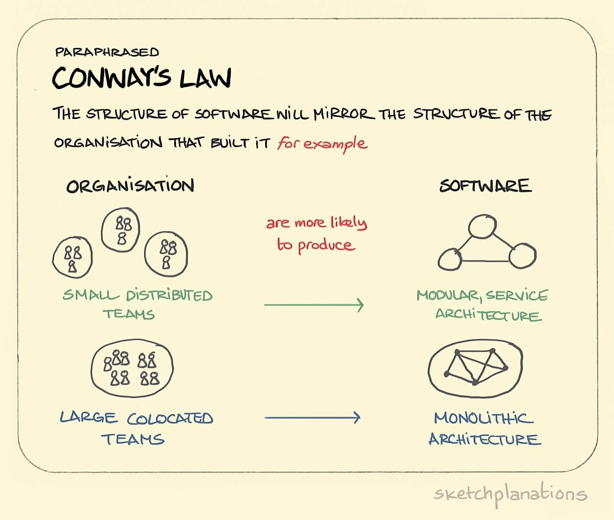
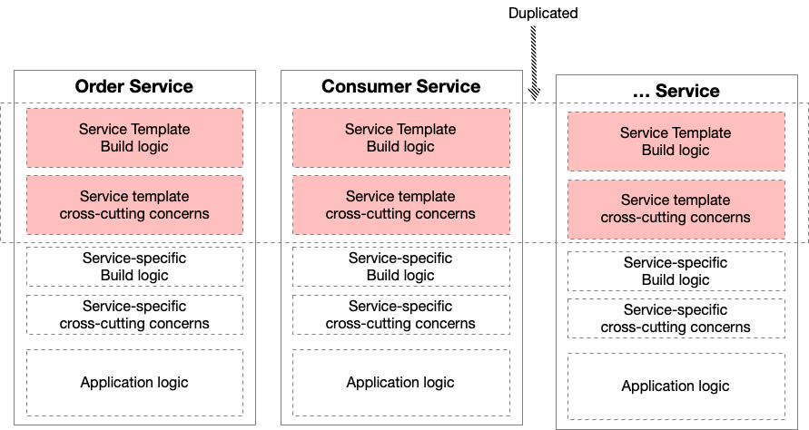
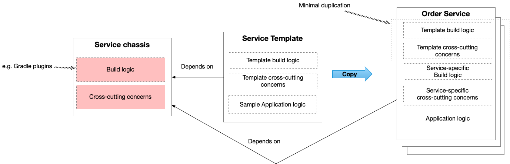

# Hafta 6

## Araştırma Ödevi

### 1. Conway’in Kanunu’nu (Conway’s Law) açıklayınız



Conway Kanunu’nu, 1967'de bu fikri ortaya atan bilgisayar programcısı Melvin Conway'in adını taşıyan bir aforizmadır. İlk olarak 1968'de düzenlenen Ulusal Modüler Programlama Sempozyumu'ndaki katılımcılar tarafından Conway Kanunu olarak adlandırıldı. Şu hususları belirtmektedir:

> "Sistemleri tasarlayan kuruluşlar ... bu kuruluşların iletişim yapılarının kopyaları olan tasarımlar üretmekle sınırlıdır."
>
> — M. Conway

Kanun, bir yazılım modülünün çalışabilmesi için birden fazla yazarın birbirleriyle sık sık iletişim kurması gerektiği mantığına dayanmaktadır. Bu nedenle, bir sistemin yazılım arayüz yapısı, iletişimin daha zor olduğu, onu üreten organizasyon(lar)ın sosyal sınırlarını yansıtacaktır. Conway Kanunu, bazen mizahi bir bağlamda alınmasına rağmen, geçerli bir sosyolojik gözlem olarak tasarlandı.

Al Shalloway, Conway Kanunu'nun Doğal Sonuçları olarak development grupları, development personelinin organizasyon yapısını değiştirdiğinde, mevcut uygulama mimarileri onlara karşı çalışacaktır.

Açık kaynak savunucusu Eric S. Raymond, Jargon File'a dayalı bir referans çalışması olan The New Hacker's Dictionary'de Conway Kanunu'nu yeniden dile getirdi. Yazılımın organizasyonu ve yazılım ekibinin organizasyonu uyumlu olacak dedi. Conway'in makalesindeki bir örneği özetleyen Raymond şöyle yazdı: "Bir derleyici üzerinde çalışan dört grubunuz varsa, 4-pass bir derleyici alırsınız."

James O. Coplien ve Neil B. Harrison şunları söyledi:

"Bir organizasyonun bölümleri (örneğin, ekipler, departmanlar veya alt bölümler) ürünün temel kısımlarını yakından yansıtmıyorsa veya kuruluşlar arasındaki ilişki, ürün bölümleri arasındaki ilişkileri yansıtmıyorsa, proje sıkıntılı olacaktır. ... Bu nedenle: Kuruluşun ürün mimarisiyle uyumlu olduğundan emin olun."

Conway Kanunu'nun etkisi, kurumsal web sitelerinin tasarımında görülebilir. Bir kullanılabilirlik uzmanı olan Nigel Bevan şunları söyledi: "Kuruluşlar genellikle site kullanıcılarının ihtiyaçlarından ziyade kuruluşun iç kaygılarını yansıtan bir içerik ve yapıya sahip web siteleri üretir." Web siteleri komite tarafından tasarlandığında da benzer bir etki bulunabilir.

### 2. Software as a Service (SaaS), Platform as a Service (PaaS), Infrastructure as a Service (IaaS), On-Premises kavramlarını örneklerle açıklayınız

"As-a-service" genellikle, kodunuz ve müşterilerinizle ilişkileriniz gibi sizin için daha önemli olan şeylere odaklanabilmeniz için üçüncü bir tarafça sağlanan bir bulut bilişim hizmeti anlamına gelir. Bulut bilişimin her türü size giderek daha az şirket içi altyapıyı yönetmenizi sağlar.

On-premise IT, bir kullanıcı ve yönetici olarak size sorumluluk seviyesinin en büyük seviyesini sunar. Donanım ve yazılımlarınızın tamamı şirket içinde olduğunda, her bileşeni gerektiği gibi yönetmek, güncellemek ve değiştirmek size ve ekibinize bağlıdır. Bulut bilişimin sağladığı şey, altyapınızın bir, birkaç veya tüm bölümlerinin üçüncü bir tarafın yönetimine tahsis edilmesi ve sizi başka şeylere odaklanmak için özgür kılmaktır.

As-a-service olarak 3 ana bulut bilişim seçeneği türü vardır ve her biri sizin için bir yönetim derecesini kapsar: infrastructure-as-a-service (IaaS), platform-as-a-service (PaaS) ve software-as-a-service (SaaS).


#### 2.1. IaaS

Infrastructure-as-a-service (IaaS), şirket içi altyapıdan bir adım ötededir. Üçüncü bir tarafın size depolama ve sanallaştırma gibi altyapı hizmetlerini ihtiyaç duyduğunuz şekilde bir bulut üzerinden internet üzerinden sağladığı, kullandıkça öde hizmetidir.

Kullanıcı olarak, işletim sisteminden ve tüm verilerden, uygulamalardan, ara katman yazılımlarından ve çalışma zamanlarından siz sorumlusunuz, ancak bir provider sizin ihtiyaç duyduğunuz ağa, sunuculara, sanallaştırmaya ve depolamaya erişim ve bunların yönetimini sağlar.

Provider sizin yerinize yaptığı için on-site veri merkezinizin bakımını yapmanız veya güncellemeniz gerekmez. Bunun yerine, altyapıya bir uygulama programlama arabirimi (API) veya kontrol paneli aracılığıyla erişir ve bunları kontrol edersiniz.

IaaS, yalnızca ihtiyacınız olan bileşenleri satın alma ve bunları gerektiği gibi büyütme veya küçültme esnekliği sağlar. Ek yük düşüktür ve bakım maliyeti yoktur, bu da IaaS'ı çok uygun fiyatlı bir seçenek haline getirir. Geliştirme ortamınızı oluşturmak için yalnızca ihtiyacınız olan altyapıyı kullanabilir ve ihtiyaç duyduğunuz süre boyunca büyütebilir veya küçültebilirsiniz ve işiniz bittiğinde yalnızca kullandığınız kadar ödeyerek durabilirsiniz.

IaaS'nin başlıca dezavantajları, provider güvenlik sorunları, provider'ın altyapı kaynaklarını birden çok istemciyle paylaşması gereken çok kiracılı sistemler ve hizmet güvenilirliği olasılıklarıdır. Sağlam bir geçmişe ve itibara sahip güvenilir ve güvenilir bir provider seçerek bu dezavantajlardan kaçınılabilir.

AWS, Microsoft Azure ve Google Cloud gibi genel bulut sağlayıcıları IaaS örnekleridir.

#### 2.2. PaaS

Hizmet olarak platform (PaaS), eksiksiz, şirket içi altyapı yönetiminden başka bir adımdır. Bir sağlayıcının kendi altyapısı üzerinde donanım ve yazılımı barındırdığı ve bu platformu bir internet bağlantısı üzerinden entegre bir çözüm, çözüm stack'i veya hizmet olarak kullanıcıya sunduğu yerdir.

Öncelikle geliştiriciler ve programcılar için faydalı olan PaaS, kullanıcının genellikle süreçle ilişkilendirilen altyapı veya platformu oluşturmak ve sürdürmek zorunda kalmadan kendi uygulamalarını geliştirmesine, çalıştırmasına ve yönetmesine olanak tanır.

Kod yazar, derler ve uygulamalarınızı yönetirsiniz, ancak bunu yazılım güncellemeleri veya donanım bakımının baş ağrıları olmadan yaparsınız. Build ve deploy ortamı sizin için sağlanır.

PaaS, geliştiricilerin web tabanlı uygulamalarını oluşturmak ve özelleştirmek için bir framework oluşturabilmelerinin bir yoludur. Geliştiriciler, uygulamalarını oluşturmak için built-in yazılım bileşenlerini kullanabilir, bu da kendilerinin yazmaları gereken kod miktarını azaltır.

Birkaç PaaS örneği, AWS Elastic Beanstalk, Heroku ve Red Hat OpenShift'tir.

####  2.3. SaaS

Cloud application hizmetleri olarak da bilinen software-as-a-service (SaaS), bir web tarayıcısı aracılığıyla bir sağlayıcı tarafından yönetilen bir uygulamanın tamamını sunan en kapsamlı bulut bilişim hizmetleri biçimidir.

Yazılım güncellemeleri, hata düzeltmeleri ve genel yazılım bakımı, sağlayıcı tarafından gerçekleştirilir ve kullanıcı, bir dashboard veya API aracılığıyla uygulamaya bağlanır. Yazılımın tek tek makinelere yüklenmesine lüzum yoktur ve programa grup erişimi daha sorunsuz ve daha güvenilirdir.

Örneğin, Outlook veya Gmail gibi web tabanlı bir hizmete sahip bir e-posta hesabınız varsa, bir SaaS biçimine zaten aşinasınızdır, çünkü hesabınıza giriş yapabilir ve herhangi bir bilgisayardan herhangi bir yerden e-postanızı alabilirsiniz.

SaaS, yazılım yükleme ve güncellemelerini gerçekleştirecek personele veya bant genişliğine sahip olmayan küçük işletmelerin yanı sıra fazla özelleştirme gerektirmeyen veya yalnızca periyodik olarak kullanılacak uygulamalar için harika bir seçenektir.

SaaS'ın size zaman ve bakım açısından kazandırdığı şeyler haricinde, kontrol, güvenlik ve performans açısından size pahalıya mal olabilir, bu nedenle güvenebileceğiniz bir sağlayıcı seçmeniz önemlidir.

Dropbox, Salesforce, Google Apps ve Red Hat Insights, SaaS'ın bazı örnekleridir.

#### 2.4. On-premise

On-premise infrastructure veya private cloud, yalnızca bir istemci tarafından kullanılabilen bir bulut ortamıdır. Şirketler, bir kaynak havuzunu birden fazla müşteriyle paylaşmak yerine, özel bir bulutun sağladığı tüm kaynaklara tam erişime sahiptir. Özel bulutlar, bir kuruluşun veri merkezinde bulunabilir veya saha dışında bulunabilir ve bir üçüncü tarafça yönetilebilir. Özel bulutlar, katı düzenlemelerle uyumluluğu basitleştirebilecek daha güvenli bir ortam sağlar. Özel bulutlar, veri yönetişimi ve veri yerelliği sorunlarını basitleştirir ve yüksek SLA performansı ve verimliliği sağlayabilir.

### 3. Continuous Integration, Continuous Delivery ve Continuous Deployment kavramlarını açıklayınız


#### 3.1. Continuous Integration

Continuous integration uygulayan geliştiriciler, değişikliklerini mümkün olduğunca sık main branch'e merge ederler. Geliştiricinin değişiklikleri build edilir ve bu build için automated testler çalıştırılarak doğrulanır. Bunu yaparak, değişiklikleri release branch'te birleştirmek için release gününü beklerken oluşabilecek entegrasyon zorluklarından kaçınmış olursunuz.

Continuous integration, main branch'e yeni commit'ler entegre edildiğinde uygulamanın bozulmadığını kontrol etmek için test otomasyonuna büyük önem verir.

#### 3.2. Continuous Delivery

Continuous delivery, tüm kod değişikliklerini build aşamasından sonra bir test ve/veya production ortamına otomatik olarak dağıttığı için sürekli entegrasyonun bir uzantısıdır.

Automated teste ek olarak, automated bir release process olduğu ve bir düğmeye tıklayarak uygulamanızı istediğiniz zaman deploy edebileceğiniz anlamına gelir.

Teoride, continuous delivery ile günlük, haftalık, iki haftada bir veya iş gereksinimlerinize uygun olarak release etmeye karar verebilirsiniz. Ancak, continuous delivery'nin avantajlarından gerçekten yararlanmak istiyorsanız, bir sorun olması durumunda sorun gidermesi kolay olan küçük batch'ler release ettiğinizden emin olmak için mümkün olduğunca erken production'a deploy etmelisiniz.

#### 3.3. Continuous Deployment

Continuous deployment, continuous delivery'den bir adım daha ileri gider. Bu uygulama ile production pipeline'ının tüm aşamalarından geçen her değişiklik müşterilerinize iletilir. İnsan müdahalesi yoktur ve yalnızca başarısız bir test, production'a yeni bir değişikliğin deploy edilmesini engeller.

Continuous deployment, müşterilerinizle olan geri bildirim döngüsünü hızlandırmanın ve artık Release Day olmadığı için ekibin üzerindeki baskıyı azaltmanın mükemmel bir yoludur. Geliştiriciler yazılım oluşturmaya odaklanabilir ve üzerinde çalışmayı bitirdikten dakikalar sonra çalışmalarının canlı hale geldiğini görebilirler.

### 4. API Gateway pattern’ı açıklayınız

API Gateway, microservice'lere yapılan çağrıları tek bir location'da toplar. Kullanıcı, API Gateway'e tek bir çağrı yapar ve ardından API Gateway ilgili her bir microservice'i çağırır.

Microservices pattern'la, bir client birden çok farklı microservice'ten gelen verilere ihtiyaç duyabilir. Eğer client her microservice'i doğrudan çağırsaydı, client'ın çağrılan her microservice için bir ağ isteği yapması gerekeceğinden, bu daha uzun yükleme sürelerine sebep olabilir. Ayrıca, client'in her bir microservice'i araması, client'ı doğrudan o microservice'e bağlar - microservice'lerin dahili uygulamaları değişirse (örneğin, gelecekte iki microservice birleştirilirse) veya bir microservice'in location'u (ana bilgisayar ve bağlantı noktası) değişirse, bu microservice'lerden yararlanan her client güncellenmelidir.

API Gateway pattern’ın amacı, bu sorunlardan bazılarını hafifletmektir. API Gateway pattern'da client ile microservice'ler arasına ek bir entity (API Gateway) yerleştirilir. API Gateway'in işi, çağrıları microservice'lere toplamaktır. Client'ın her bir microservice'i ayrı ayrı çağırması yerine, client API Gateway'i tek bir kez çağırır. API Gateway daha sonra client'ın ihtiyaç duyduğu microservice'lerin her birini çağırır.

#### 4.1. Program Örneği

Bu implamantasyon bir e-ticaret sitesi için API Gateway pattern'ın nasıl görünebileceğini gösterir. `ApiGateway`, sırasıyla `ImageClientImpl` ve `PriceClientImpl` kullanarak Image ve Price microservice'lerine çağrı yapar. Siteyi bir masaüstü cihazda görüntüleyen müşteriler, hem fiyat bilgilerini hem de bir ürünün görüntüsünü görebilir, böylece `ApiGateway` her iki microservice'i de çağırır ve `DesktopProduct` modelindeki verileri toplar. Ancak, mobil kullanıcılar yalnızca fiyat bilgilerini görür; bir ürün resmi görmezler. Mobil kullanıcılar için, ApiGateway yalnızca `MobileProduct`'ı populate etmek için için kullandığı fiyat bilgilerini alır.

```java
// Image microservice implementation
public interface ImageClient {
  String getImagePath();
}

public class ImageClientImpl implements ImageClient {
  @Override
  public String getImagePath() {
    var httpClient = HttpClient.newHttpClient();
    var httpGet = HttpRequest.newBuilder()
        .GET()
        .uri(URI.create("http://localhost:50005/image-path"))
        .build();

    try {
      var httpResponse = httpClient.send(httpGet, BodyHandlers.ofString());
      return httpResponse.body();
    } catch (IOException | InterruptedException e) {
      e.printStackTrace();
    }

    return null;
  }
}
```

```java
// Price microservice implementation
public interface PriceClient {
  String getPrice();
}

public class PriceClientImpl implements PriceClient {

  @Override
  public String getPrice() {
    var httpClient = HttpClient.newHttpClient();
    var httpGet = HttpRequest.newBuilder()
        .GET()
        .uri(URI.create("http://localhost:50006/price"))
        .build();

    try {
      var httpResponse = httpClient.send(httpGet, BodyHandlers.ofString());
      return httpResponse.body();
    } catch (IOException | InterruptedException e) {
      e.printStackTrace();
    }

    return null;
  }
}
```

```java
// Here we can see how API Gateway maps the requests to the microservices.
public class ApiGateway {

  @Resource
  private ImageClient imageClient;

  @Resource
  private PriceClient priceClient;

  @RequestMapping(path = "/desktop", method = RequestMethod.GET)
  public DesktopProduct getProductDesktop() {
    var desktopProduct = new DesktopProduct();
    desktopProduct.setImagePath(imageClient.getImagePath());
    desktopProduct.setPrice(priceClient.getPrice());
    return desktopProduct;
  }

  @RequestMapping(path = "/mobile", method = RequestMethod.GET)
  public MobileProduct getProductMobile() {
    var mobileProduct = new MobileProduct();
    mobileProduct.setPrice(priceClient.getPrice());
    return mobileProduct;
  }
}
```

#### 4.2. Class Diyagramı


### 5. Backend for frontend (BFF) pattern’ı açıklayınız

Backend for frontend pattern, 4. soruda incelediğimiz API Gateway pattern'ın bir varyasyonudur. Her tür client için ayrı bir API Gateway tanımlar.

Microservice'ler tarafından sağlanan API'lerin ayrıntı düzeyi, genellikle bir client'ın ihtiyaç duyduğundan farklıdır. Microservice'ler tipik olarak ayrıntılı API'ler sağlar; bu, client'ların birden çok servisle etkileşime girmesi gerektiği anlamına gelir.

Farklı client'lar farklı verilere ihtiyaç duyar. Örneğin, bir ürün ayrıntıları sayfasının masaüstü tarayıcı versiyonu, genellikle mobil sürümden daha ayrıntılıdır.

Ağ performansı, farklı client türleri için farklıdır. Örneğin, bir mobil ağ tipik olarak çok daha yavaştır ve mobil olmayan bir ağdan çok daha yüksek gecikme süresine sahiptir. Ve elbette, herhangi bir WAN, bir LAN'dan çok daha yavaştır. Bu, yerel bir mobil client'ın, sunucu tarafı web uygulaması tarafından kullanılan bir LAN'dan çok farklı performans özelliklerine sahip bir ağ kullandığı anlamına gelir. Sunucu tarafı web uygulaması, bir mobil client'ın yalnızca birkaçını yapabileceği kullanıcı deneyimini etkilemeden backend servislerine birden çok istekte bulunabilir.

Servislerin bazıları web dostu olmayabilecek çeşitli protokoller kullanabilir.

Yukarıda sayılan sebepler bizi Backend for frontend pattern'ı kullanmaya iter.


Aşağıdaki örnekte üç tür client vardır: web uygulaması, mobil uygulama ve harici 3. taraf uygulaması. Üç farklı API Gateway vardır. Her biri, client için bir API sağlar.


### 6. Circuit-breaker pattern’ı açıklayınız

Microservice architecture'ı uyguladığımızı düşünelim. Servisler bazen istekleri handle edebilmek için işbirliği yapar. Bir servis eşzamanlı olarak bir diğerini çağırdığında, diğer servisin kullanılamaması veya yüksek gecikme süresi sergilemesi, yani çağrılan servisin o esnada kullanılamaz olma olasılığı her zaman vardır. Diğer servisin yanıt vermesini beklerken caller serviste thread'ler gibi değerli kaynaklar tüketilebilir. Bu, caller'ın diğer istekleri yerine getirememesine neden olacak şekilde kaynakların tükenmesine neden olabilir. Bir servisin arızası, uygulama boyunca potansiyel olarak diğer servisleri kademeli şekilde etkileyebilir. Peki bir ağ veya servis hatasının diğer servisleri etkilemesini nasıl önleyebiliriz?

Bir servis client, bir elektrik circuit breaker'a benzer şekilde çalışan bir proxy aracılığıyla bir remote servisi çağırmalıdır. Ardışık arızaların sayısı bir eşiği aştığında, circuit breaker açılır ve bir timeout süresi boyunca remote servisi başlatmaya yönelik tüm girişimler hemen başarısız olur. Timeout sona erdikten sonra circuit breaker, sınırlı sayıda test talebinin geçmesine izin verir. Bu istekler başarılı olursa, circuit breaker normal çalışmasına devam eder. Aksi takdirde bir arıza durumunda timeout süresi yeniden başlar.

Servislerin çağırdıkları servislerin hatalarını handle etmesi bu pattern’ın bir avantajı olsa da false positive'ler oluşturmadan veya excessive latency'ye neden olmadan timeout değerlerini seçmek zordur.

### 7. Microservice chassis pattern’ı kısaca açıklayınız

Bir uygulamanın geliştirilmesine başladığınızda, build logic'i yazmak ve cross-cutting concern'leri ele alan mekanizmaları handle etmek için genellikle önemli miktarda zaman harcarsınız. Build logic, uygulamayı oluşturur ve test eder, ayrıca Docker container image gibi production-ready bir formata paketler. Örneğin, bir Java uygulaması için derleme mantığının çoğu Gradle veya Maven kullanılarak uygulanır. Ayrıca CircleCI veya Github Actions gibi build automation tool'lar için yazılmış configuration script'ler de içerebilir. Yüzeysel olarak build logic oldukça basit görünüyor. Bununla birlikte, özenle seçilmiş bir dizi dependency tanımlamak bile oldukça zor olabilir.

Build logic'e ek olarak, cross-cutting concern'leri de handle etmemiz gerekir. Cross-cutting concern örnekleri şunları içerir:

- **Security** - örneğin, REST API'lar bir Access Token gerektirilerek güvence altına alınmalıdır
- **Externalized configuration** - kimlik bilgilerini ve veritabanları, message broker'lar gibi harici hizmetlerin ağ konumlarını içerir
- **Logging** - log4j ya da logback gibi bir logging framework'ü konfigürasyonu
- **Health check** - bir monitoring servisinin uygulamanın durumunu belirlemek için "ping"leyebileceği bir url
- **Metrics** - uygulamanın ne yaptığına ve nasıl performans gösterdiğine dair fikir veren ölçümler
- **Distributed tracing** - her harici isteğe, servisler arasında geçilen benzersiz bir tanımlayıcı atayan kodlu araç hizmetleri.

Bu generic cross-cutting concern'lerin yanı sıra, bir uygulamanın kullandığı teknolojilere özgü cross-cutting concern'ler de vardır. Veritabanları veya message broker'lar gibi infrastructure servisleri kullanan uygulamalar, bunu yapabilmek için boilerplate konfigürasyona ihtiyaç duyar. Örneğin, ilişkisel bir veritabanı kullanan uygulamalar bir connection pool ile konfigüre edilmelidirler. HTTP isteklerini işleyen web uygulamaları da boilerplate konfigürasyona ihtiyaç duyar.

Build logic'i yazmak ve cross-cutting concern'leri uygulamak için bir veya iki gün, hatta bazen daha uzun süre harcamak yaygındır. Monolithic bir uygulama geliştirmek için aylar veya yıllar harcayacaksanız upfront investment önemsizdir. Ancak, microservice mimarisine sahip bir uygulama geliştiriyorsanız durum çok farklıdır. Onlarca hatta yüzlerce servis var. Her birinin geliştirilmesi yalnızca günler veya haftalar alacak olan yeni hizmetleri sık sık oluşturacaksınız. Her hizmeti ayarlamak için birkaç gün harcamayı göze alamazsınız. Daha da kötüsü, bir microservice mimarisinde, service registration ve discovery, ve cross-cutting concern'ü güvenilir bir şekilde ele almak için circuit breaker'lar dahil olmak üzere uğraşmanız gereken ek cross-cutting concern'ler vardır.

Çözümlerden biri, bir geliştiricinin yeni bir servis geliştirmeye hızla başlamak için kopyalayabileceği bir source code template olan bir Service Template oluşturmaktır. Bununla birlikte, bir Service Template'in dezavantajı, bir kopyala/yapıştır programlama biçimi olmasıdır. Build logic ve cross-cutting concern'lerin logic'i değişmesi gerektiğinde, her servis ayrı ayrı güncellenmelidir.



Bir ekip production-ready bir servis için maintainable bir code base'i business logic'i geliştirmeye başlayabilmeleri amacıyla nasıl hızla oluşturabilir ve kurabilir?

Bir servis, uygulamayı build ve test eden ve ayrıca Docker container image gibi production-ready formata paketleyen bir build logic ve haricileştirilmiş konfigüreasyon, logging, health check'ler, metric'ler, service registration ve discovery, circuit breaker'lar gibi cross-cutting concern'leri (microservice'lerin kullandığı teknolojilere özgü ortak cross-cutting concern'ler de vardır) implemente etmelidir. Yeni bir microservice oluşturmak hızlı ve kolay olmalıdır. Build logic ve cross-cutting concern'ler için gereksinimler değiştiğinde mevcut servisleri güncellemek hızlı ve kolay olmalıdır. Burada sayılan sebepler bizi microservice chassis pattern’ı uygulamaya iter.

Çözüm olarak microservice'lerinizi geliştirmek için temel oluşturabilecek bir microservice chassis framework oluşturun. Bu chassis, örneğin Gradle Plugin'leri içeren, bir servisi oluşturan ve test eden yeniden kullanılabilir build logic'i ve cross-cutting concern'leri ele alan mekanizmaları implemente etmelidir.

Service Template, microservice chassis kullanan örnek bir servistir.



Bir microservice chassis'in en büyük yararı, bir microservice geliştirmeye hızlı ve kolay bir şekilde başlayabilmenizdir.

Kullanmak istediğiniz her programlama dili/framework'ü için ayrı bir microservice chassis'e ihtiyacınız olması bir sorundur. Bu, yeni bir programlama dili veya framework'ü benimsemenin önünde bir engel olabilir.

## Kaynakça

1. [_Conway's law_](https://en.wikipedia.org/wiki/Conway%27s_law)
2. [_IaaS_ vs _PaaS_ vs _SaaS_](https://en.wikipedia.org/wiki/Conway%27s_law)
3. [_On-premise_ vs _cloud_](https://www.dell.com/tr-tr/dt/learn/cloud/on-premise-vs-cloud.htm)
4. [_Continuous integration_ vs _continuous delivery_ vs _continuous deployment_](https://www.dell.com/tr-tr/dt/learn/cloud/on-premise-vs-cloud.htm)
5. [_API Gateway_](https://java-design-patterns.com/patterns/api-gateway/)
6. [_Pattern: API Gateway / Backends for Frontends_](https://microservices.io/patterns/apigateway.html)
7. [_Pattern: Circuit Breaker_](https://microservices.io/patterns/reliability/circuit-breaker.html)
8. [_Pattern: Microservice chassis_](https://microservices.io/patterns/microservice-chassis.html)
